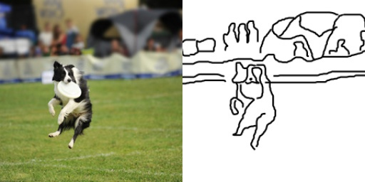

# CUDA vs. Sequential image blur software with C++

## About

### Problem description

I am tasked with implementing a gaussian blur to an input image using CUDA for CSC 630: Parallel programming.  In the interest of delving into parallel programming concepts such as speedup and processor efficiency, I am implementing the capability to perform this operation sequentially or via CUDA based on a command-line option.  

The gaussian blur operation is going to have the option use varying kernel sizes, such as 3x3, 5x5, 7x7, etc, all ensuring that there is no net increase or decrease in alpha (hence the gaussian).



## Software

### Requirements

This software requires the following libraries:
- boost (sudo apt-get install libboost-all-dev)

### Environment

This software was compiled with:
- gcc version 7.4.0 (Ubuntu 7.4.0-1ubuntu1~18.04.1)
- Ubuntu 18.04.3 LTS (Bionic Beaver)

### Compiling

* \*Nix:
`make` should compile the cpp files into o files and create blur.exe using 'Makefile'

### Running

Here are the command-line options:
```
- --debug, -d         none            boolean flag for verbose print statements
- --input, -i         input path      specify the image path for the image to blur
- --output, -o        output path     specify the image path for the blurred image
- --filtersize, -f    filter size     1 for 3x3, 2 for 5x5, 3 for 7x7
- --cuda              none            boolean flag for using cuda vs cpu
- --help, -h          none            display help for this program
```

Example execution on Linux command-line:
./blur.exe --debug --input img/dog.jpg --filtersize 2

## Authors

* **Dan McGonigle** [dpmcgonigle](https://github.com/dpmcgonigle)
